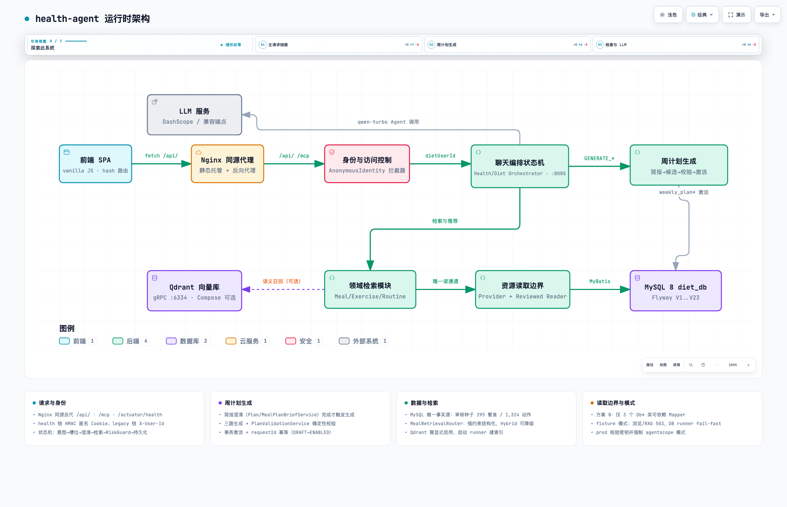

# health-agent · 三品类统一健康助手

[](https://github.com/Leewwp/health_agent/actions/workflows/ci.yml)


覆盖**饮食、健身、作息**三品类的统一健康对话 Agent：由 Java 状态机确定性编排多角色工作流，LLM 只负责语义理解和受约束表达；配套餐食混合检索（RAG）、健康档案与事务化周计划、契约化降级、风险护栏、全链路 Trace 与离线评估体系，并以 MCP 协议向外开放只读领域能力。

> **口径说明**：这里的「多 Agent」指由 Java 状态机确定性编排的多角色工作流，**不是多个自治 Agent 自主规划或调用工具**。候选召回、数值、风险和状态转换由 Java 控制，LLM 负责语义理解和受约束表达。

**工程规模**：910 个自动化测试（`mvn test` 2026-08-31 实测：0 失败、53 个环境门控跳过）、12 个真实 MySQL 集成测试类（`-Ditest.mysql=true` 门控）、42 个前端行为契约测试、Flyway V1–V24 迁移、GitHub Actions CI、Docker Compose 一键部署。无 API Key 也能完整启动与演示——确定性降级本身就是 Fallback 设计的现场演示点。

---

## 目录

- [演进：从 diet-agent 到 health-agent](#演进从-diet-agent-到-health-agent)
- [核心设计](#核心设计)
- [运行时架构](#运行时架构)
- [快速开始](#快速开始)
- [餐食 RAG 与评测](#餐食-rag-与评测)
- [MCP 服务端](#mcp-服务端)
- [测试与 CI](#测试与-ci)
- [配置注入](#配置注入)
- [数据管线](#数据管线)
- [部署（Compose）](#部署compose)
- [文档导航](#文档导航)
- [边界](#边界)

---

## 演进：从 diet-agent 到 health-agent

本项目是单品饮食推荐 Agent（diet-agent）的重构升级。旧项目验证了「多 Agent + Trace + 评估」的架构判断，但在工程上有欠账：0 个测试、无数据库迁移、LLM 调用无统一契约、推荐无检索增强。升级做了两件事：

| 维度 | diet-agent（旧） | health-agent（新） |
| --- | --- | --- |
| 产品范围 | 单品类饮食推荐 | 三品类统一健康聊天，旧 `/api/v1/diet/**` 保持兼容 |
| 意图模型 | 6 类意图枚举 + 7 维槽位 | 正交意图模型：domain × task × riskFlags × phase |
| LLM 调用 | 业务服务直接持有 ReActAgent | `AgentInvoker` 运行接口隔离 + 统一契约 + 六类失败分类 |
| 失败处理 | 各环节各自 fallback | 契约化、分类化、可观测的确定性降级 |
| 检索 | MySQL 标签检索 + 打分 | 混合 RAG + 两段式路由 + 回查二次硬约束 |
| 计划能力 | 口头多餐建议 | 可持久化周计划：生命周期 + 事务 + 行锁 + 唯一约束 + 版本快照 |
| 测试 | **0 个** | **910 个**（含真实 MySQL 集成场景） |
| 数据工程 | 手工 dump | Flyway V1–V24 + Python ETL 管线 |

## 核心设计

### 1. 正交意图模型与确定性编排

单品类时代 6 意图枚举够用，三品类下组合爆炸（3 品类 × 5 任务 = 15 枚举值，每加一维全链路都要改）。重构为正交分解：

```text
domain（品类）  MEAL / EXERCISE / ROUTINE / COMPOSITE   → 决定领域模块
task（任务）    CHAT / BROWSE / RECOMMEND / PLAN / ADJUST → 决定流程形态
riskFlags      由 RiskRuleCatalog 判定                    → 叠加在任何意图上，触发拦截
phase          会话状态机阶段                              → 与意图解耦
```

意图决定流程、风险决定拦截、阶段决定状态，三者不互相污染。`HealthOrchestratorService` 管状态流转与路由，`MealModule` / `ExerciseModule` / `RoutineModule` 各管检索与生成；跨品类话题切换时未完成的计划简报进入暂停而非丢弃。明示偏好（`preferenceSignals`，如「我不吃香菜」）与需求槽位（「想吃清淡的」）分开表达，避免临时偏好被误存为长期偏好。

### 2. Agent 契约化调用与确定性降级

生产视角下 LLM 是**不可靠依赖**：超时、限流、非法 JSON、字段越界、编造候选 ID 都会发生。降级从「散落的 if 补丁」升级为「契约」：

- **依赖倒置**：`AgentInvoker` 运行接口隔离 AgentScope——`AgentScopeInvoker`（真实 DashScope，主/轻双模型路由兼顾延迟与成本）与 `FixtureAgentInvoker`（版本化固定夹具）可切换，业务模块不接触 `ReActAgent`；无 API Key 时全链路测试与演示照常进行；
- **契约统一**：每个 Agent 调用带 contractVersion / promptVersion / 输入输出 DTO / 校验器，输出必须通过 JSON 解析（剥 markdown fence）→ Schema 校验 → 枚举校验 → 候选 ID 校验；
- **失败分类与确定性降级**：六类失败 `TIMEOUT / UPSTREAM_UNAVAILABLE / INVALID_JSON / SCHEMA_VIOLATION / CANDIDATE_VIOLATION / MISSING_CONFIG`，每类有对应确定性降级路径（模板接管），失败原因写入 Trace。任一 LLM 异常，对话始终有回复，且下次请求不残留脏状态。

### 3. 混合检索 RAG 与两段式路由

设计原则：**RAG 只负责候选召回，硬约束过滤和最终排序永远在 Java/MySQL 完成**——语义相近不等于约束满足，把含过敏原的餐食召回给过敏用户是事故。

```text
用户输入
  → MealRetrievalRouter 两段式路由
      ├─ 有强约束（餐次/过敏原/排除项）→ Structured 结构化检索
      └─ 无强约束且含主观/长尾语义词 → Hybrid 混合检索
            ├─ 结构化召回（MySQL）
            └─ Qdrant 独立向量召回（payload 过滤审核状态/来源/过敏原/排除 ID）
                  → 候选融合（权重可配，默认 0.5/0.5）
                  → 按 ID 回查 MySQL 二次执行全部硬约束
                  → 过期索引命中直接丢弃
  → 打分排序 → LLM 仅对已排序候选生成推荐理由
```

- **MySQL 是事实源，Qdrant 只是可重建索引**：collection 名由 provider + 模型 + 维度 + 版本身份派生，embedding 变更自动换新 collection，维度不匹配直接降级；
- **降级显式化**：Embedding/Qdrant 不可用、超时或空结果时立即退回结构化检索并标记降级原因（`vector_store_unavailable` / `embedding_unavailable` / `no_vector_hits`），评测报告单独统计降级分布；
- **双 Embedding 适配器**：DashScope text-embedding-v3 默认，MiniMax embo-01 实验对照，可经配置切换。

[评测结果与两段式路由的推导过程见下文](#餐食-rag-与评测)。

### 4. 健康档案与事务化周计划

数值类结论（能量、宏量、训练剂量）绝不能让 LLM 编：

- **确定性量化**：健康档案 + Mifflin-St Jeor 公式计算每日能量区间，输入与计算依据可解释；
- **计划简报（Plan Brief）**：生成前先收集结构化需求，支持口语化修改——确定性解析星期与中文时间，解析结果分 `EXTRACTED / PARTIAL / AMBIGUOUS / UNRELATED / INVALID` 五类，规则无法安全解析时才调用一次结构化提取 Agent 兜底，候选经 Java 校验后合并；
- **受约束生成**：LLM 只能在「计划资格」候选白名单里排期，资格、风险、日程、剂量由确定性规则校验（Java Guard）；Agent 不可用时规则降级依据同一份简报照样生成——计划永远不会因为 LLM 挂掉而无法生成；
- **范围隔离**：新计划只允许 EXERCISE / MEAL / COMPOSITE 三种范围，综合计划仅在两个子简报分别确认后由确定性服务合并；
- **生命周期与并发正确性**：DRAFT → UNENABLED → ENABLED → HISTORY 状态机；事务化写入 + 行锁 + 数据库级按用户 ENABLED 唯一约束 + requestId 幂等 + 版本快照（档案/规则/会话/事实/资源五类生成依据进快照）。真实 MySQL 集成测试验证：任一步失败无半成品、并发启用只有一份 ENABLED。

### 5. 风险治理（RiskRuleCatalog）

风险拦截（孕产、极端节食、医疗诊断诉求）收敛为**单一版本化规则目录**——唯一事实源，目录自身有一致性测试。NORMAL / ADVISORY / BLOCK_PLAN 三档固定中文文案，不交给 LLM 临场发挥；候选前 / 组合时 / 输出后三阶段 Guard，风险检查不依赖单一出口。LLM 可以帮助理解用户表述，但风险判定与风险文案不经过模型。

### 6. 可观测、可评估、可开放

- **全链路 Trace + PII 脱敏**：每步事件、Agent 调用、token、耗时、降级原因落库；健康档案等敏感输入只记摘要或脱敏值；管理员 Trace 诊断工作台按 stepOrder 展示事件时间线与脱敏 JSON（`ADMIN_TOKEN` 保护）；
- **health-eval-v2 评估引擎**：36 样本版本化标注基准、10+ 指标全部带有效分母（缺 gold 记 null 不记 0 分）、fixture 模式可回归，报告记录 git commit / 数据集版本 / 规则版本，数字可溯源；
- **MCP 服务端**：领域能力以标准协议开放给外部 Agent 生态（[见下文](#mcp-服务端)）。

## 运行时架构



（由 [docs/runtime-architecture.html](docs/runtime-architecture.html) 导出；交互版可直接用浏览器打开。）

组件速览：

| 组件 | 职责 |
| --- | --- |
| 前端 SPA（`frontend/`） | 原生 ES Modules 无构建方案：hash 路由 / fetch 封装 / 轻量 store / 聊天、浏览、档案、计划、admin 页面 |
| Nginx | 静态托管 + 同源反代 `/api/`、`/mcp` 与健康检查，消除 CORS |
| 身份层 | HMAC 匿名 Cookie（`HEALTH_SESSION`）替代客户端自报身份；admin token 隔离 |
| 编排层 | `HealthOrchestratorService` 状态机：意图 → 澄清 → RiskGuard → 领域模块 |
| Agent 层 | `AgentInvoker` 契约化调用 DashScope / 夹具；六类失败分类与确定性降级 |
| 检索层 | `MealRetrievalRouter` 两段式路由；结构化（MySQL）/ 混合（+Qdrant）双实现 |
| 计划层 | 简报 → 受约束生成 → Java Guard → 事务化激活；版本快照 |
| 数据层 | MySQL 8（Flyway V1–V24）；Qdrant 向量索引（可重建，非事实源） |

## 快速开始

环境要求：Java 21、Maven 3.9+、MySQL 8。

### 一键启动（推荐）

```bash
./scripts/start-local.sh     # 启动并自动打开 http://localhost:8092/#/chat
./scripts/stop-local.sh      # 停止后端与前端 Nginx 容器（不动 MySQL/Qdrant 数据）
```

脚本行为：检查 Java 21 / Maven / Docker / 本机 MySQL → 编译并后台启动 Spring Boot → 等待 `/actuator/health` UP → 无状态容器在 8092 端口重建前端 Nginx 并同源反代 → 自检通过后打开浏览器。日志在 `.local-run/logs/`。端口被无关进程占用时报错退出，绝不静默换端口（可用 `BACKEND_PORT=8083 FRONTEND_PORT=8093` 换端口）。

页面：健康聊天（`#/chat`）、餐食浏览（`#/meals`）、动作浏览（`#/exercises`）、健康档案（`#/profile`）、周计划（`#/plans`）、admin（Trace 诊断工作台 / 评估报告页）。

### 手动启动

1. 启动本机 MySQL（默认 `root/123456`）；
2. `mvn spring-boot:run`（Flyway 自动迁移：全新库直接建表，已有旧库自动 baseline；启动时幂等导入审核资源）；
3. 在仓库根目录 `.env` 配置 `DASHSCOPE_API_KEY=...`（文件已被 Git 忽略；无 key 时聊天确定性降级为模板，服务照常启动）。

服务默认运行在 `http://localhost:8080`。

## 餐食 RAG 与评测

固定标注查询集：60 条六层（精确标签 / 自然语言 / 长尾表达 / 同义词 / 排除项 / 过敏原各 10 条）。2026-08-27 在本地 MySQL + Qdrant 上的 REAL_HYBRID 运行（295/295 条索引、60/60 零降级）：

| 指标 | Structured | Hybrid | 差值 |
| --- | ---: | ---: | ---: |
| Recall@3 | 0.2646 | 0.2716 | +0.0070 |
| Precision@3 | 0.7778 | 0.7944 | +0.0167 |
| 硬约束命中率 | 1.000 | 1.000 | 0 |
| P95 延迟 | 9.1 ms | 247.4 ms | +238 ms |

语义融合带来小幅召回提升，但延迟放大 27 倍。再用 12 条人工标注语义挑战集对照三种策略：

| 策略 | Recall@10 | 平均延迟 | 硬约束违规 |
| --- | ---: | ---: | ---: |
| Structured | 0.2167 | 5.7 ms | 0 |
| Hybrid（全量） | 0.2500 | 212.2 ms | 0 |
| **TwoStage 两段式** | 0.2167 | **83.7 ms** | 0 |

两段式路由把有强约束的查询保护在结构化路径、只让无强约束的语义词走向量路径：延迟降到全量 Hybrid 的 40%、硬约束零违规。所以线上默认 Structured，Hybrid/TwoStage 作为可开关的实验路径——由评测决策，不是拍脑袋。

评测报告记录每条查询的结构化/向量/融合候选数与阶段延迟，顶层标注 `runClassification`（REAL_HYBRID / PARTIAL_HYBRID / FALLBACK_ONLY），降级运行不允许被当成 Hybrid 效果引用。数字以 `data/reports/rag_evaluation.json`、`semantic_challenge_v1.json` 为准，完整记录见 [docs/research/meal-rag-evaluation.md](docs/research/meal-rag-evaluation.md)。

### 运行评测与向量索引（需要真实 API key）

```bash
# 生成向量（幂等写入 meal_item_embedding）
mvn spring-boot:run -Dspring-boot.run.arguments="--diet.embedding.generate-on-startup=true"
# 运行固定查询集评估 → data/reports/rag_evaluation.json
mvn spring-boot:run -Dspring-boot.run.arguments="--diet.rag.eval-run=true"
# 批量索引到 Qdrant（Compose 启动后，gRPC 6334）
mvn spring-boot:run -Dspring-boot.run.arguments="--diet.vectorstore.mode=qdrant --diet.vectorstore.index-on-startup=true"
```

MiniMax embo-01 对照实验需在 `.env` 配置 `DIET_EMBEDDING_PROVIDER=minimax` 等变量并使用独立报告路径（`rag_evaluation_minimax.json`），只用于效果对照，不改变线上默认 Structured。不要提交 `.env` 或任何真实 key。

## MCP 服务端

应用在 `/mcp` 注册单一 MCP Streamable HTTP 端点（MCP Java SDK 0.17.0 servlet transport），供外部 MCP 客户端发现与调用只读/纯计算工具：

| 工具 | 作用 | 复用领域服务 |
| --- | --- | --- |
| `search_meals` | 按健康槽位检索审核餐食（含硬约束与混合检索） | `MealModule.recommendMeals` |
| `get_meal_detail` | 按资源 ID 查审核餐食详情 | `HealthResourceProvider.mealById` |
| `get_routine_facts` | 按关键词查结构化作息事实 | `RoutineModule.lookup` |
| `calculate_targets` | 确定性计算每日能量区间（不写档案） | `EnergyCalculator` |

设计要点：

- handler 直接调用领域服务，不走 HTTP 自回调，零业务写入；
- **Skills Registry**：三个版本化技能 manifest（YAML），启动时强校验（Schema 可解析、`allowed_tools` 在白名单内、name 唯一），非法 manifest 直接拒绝启动；以 `skill://<name>` 稳定 URI 暴露；
- **安全边界 fail-closed**：Bearer `MCP_API_TOKEN` 鉴权，未配置 token 时拒绝所有请求；Origin 精确白名单（scheme/host/port 全等），空 allowlist 不表示任意来源；prod 启用 token 时必须显式配置 allowlist 否则启动失败。该实现不声明 MCP OAuth 2.1 全量合规。

## 测试与 CI

```bash
mvn test                            # 910 个测试：0 失败、53 个环境门控跳过（2026-08-31 实测）
mvn test -Ditest.mysql=true         # 真实 MySQL 集成：12 个测试类全绿，仅 Qdrant/live-model 独立门控跳过
node --test frontend/tests/*.test.mjs   # 前端行为契约 42/42
```

- **单元 / 契约层**：Agent 契约（合法/非法 JSON、Schema/候选越界、超时、无 key）、意图路由、计划简报与话题切换、风险目录一致性、幂等与 Trace 内容、MCP 端点安全边界、Trace 脱敏、混合检索与两段式路由、餐食 facet 数据契约（`data/meal/facets.json` 唯一事实源 + 漂移守卫）；
- **真实 MySQL 集成层**（`-Ditest.mysql=true` 门控，独立测试库自动迁移）：事务回滚无半成品、行锁、并发启用唯一、档案版本一致性、范围化生成 requestId 幂等、八槽位 AND/OR/「三餐」兼容与稳定排序；
- **CI**：GitHub Actions，Java 21 + MySQL 8.4 服务容器跑 MySQL 门控全量，失败自动上传 surefire 报告；
- **夹具与真实双模式**：fixture 保证回归稳定性（CI 稳定跑全量），真实模型用冒烟验证集成，两者互补不可互相替代。

## 配置注入

| 环境变量 | 用途 | 默认 |
| --- | --- | --- |
| `DASHSCOPE_API_KEY` | DashScope 模型 key（`.env` / 系统环境变量，空则降级） | 空 |
| `DASHSCOPE_BASE_URL` | DashScope 兼容端点 | 官方地址 |
| `DIET_LLM_MAIN_MODEL` / `DIET_LLM_LIGHT_MODEL` | 主生成 / 轻量模型 | `qwen-turbo` |
| `DIET_SESSION_SECRET` | 匿名 Cookie HMAC 密钥 | dev-only |
| `ADMIN_TOKEN` | admin 调试入口 token | 空（dev 不启用保护） |
| `DATABASE_URL/USERNAME/PASSWORD` | prod 数据源 | dev 用本地 root/123456 |
| `DIET_VECTORSTORE_MODE` | 向量索引模式（in-memory/qdrant） | `in-memory` |
| `QDRANT_HOST/QDRANT_GRPC_PORT` | Qdrant gRPC 地址 | `localhost`/`6334` |
| `MCP_API_TOKEN` | `/mcp` Bearer token（未配置 fail-closed） | 空 |
| `MCP_ALLOWED_ORIGINS` | Origin allowlist（逗号分隔） | 空 |
| `DIET_MCP_ALLOW_MISSING_ORIGIN` | 缺失 Origin 是否放行 | `false` |

- **dev**（默认）：允许 `X-User-Id` 回退、admin 不保护；
- **prod**（`--spring.profiles.active=prod`）：拒绝 `X-User-Id`、强制 `ADMIN_TOKEN`、Cookie Secure；缺少 `DASHSCOPE_API_KEY` / `DIET_SESSION_SECRET` / `ADMIN_TOKEN` 时启动失败（fail-closed）；
- **Agent 模式**：`diet.agent.mode=fixture` 离线演示，默认 `agentscope` 走真实模型，prod 强制 `agentscope`。

## 数据管线

Python ETL（`scripts/build_reviewed_resources.py`）：1,000 食谱 CSV + 1,324 动作数据集 → 清洗 → 295 审核餐食 + 30 个 plan_ready 动作 + 15 条作息事实 seed SQL + ETL 报告（`data/reports/resource_etl_report.json`）。动作原始字段（目标肌群/协同肌群/器材）保真导入，缺失字段明确标记并排除计划资格。审核资源由 `ReviewedResourceSeeder` 启动幂等导入；餐食 facet 以 `data/meal/facets.json` 为规范词表唯一事实源（ETL、Java 归一器、提示词与前端筛选全部由它生成或读取）。

## 部署（Compose）

```bash
cp deploy/.env.example .env   # 填写 DIET_SESSION_SECRET / ADMIN_TOKEN 等
docker compose up -d --build
```

单实例 Nginx + Spring Boot + MySQL（可选 Qdrant）。迁移前 `mysqldump` 备份；失败回退上一镜像 tag 或前向修复，不做破坏性自动回滚；健康检查 `/actuator/health`。

## 冒烟示例

```bash
# 健康聊天（三品类）
curl -X POST http://localhost:8080/api/v1/health/chat -H 'Content-Type: application/json' \
  -d '{"requestId":"demo-1","message":"午餐想吃清淡的"}'
# 风险拦截
curl -X POST http://localhost:8080/api/v1/health/chat -H 'Content-Type: application/json' \
  -d '{"requestId":"demo-2","message":"我怀孕了怎么安排饮食"}'
# 审核资源浏览（分页，size≤50）
curl "http://localhost:8080/api/v1/health/meals?page=1&size=20"
curl "http://localhost:8080/api/v1/health/exercises?page=1&size=20"
```

## 文档导航

| 主题 | 位置 |
| --- | --- |
| 架构决策记录（17 篇 ADR） | [docs/adr/](docs/adr/)（0002 正交意图、0004 RAG 边界、0006 分层风险、0010 读取边界、0014 统一周计划、0016 显式任务路由、0017 餐食 facet…） |
| 领域词汇与产品概念 | [CONTEXT.md](CONTEXT.md) |
| 架构 / 表结构 / 测试基线 | [AGENTS.md](AGENTS.md) |
| RAG 评测记录 | [docs/research/meal-rag-evaluation.md](docs/research/meal-rag-evaluation.md) |
| 评估报告原始数据 | `data/reports/*.json` |
| MVP 阶段口径与证据 | [docs/mvp-phases.md](docs/mvp-phases.md)、[docs/release-evidence.md](docs/release-evidence.md) |
| 面试适用性复核 | [docs/agent-mvp-suitability-review.md](docs/agent-mvp-suitability-review.md) |
| 前端浏览器验收 | [docs/frontend-browser-acceptance.md](docs/frontend-browser-acceptance.md) |

## 边界

这是工程化演示项目（单实例交付拓扑，ADR-0007），不是生产系统：

- 无真实账号体系与线上流量——身份是服务端签发的匿名演示身份；
- 不做医疗诊断：面向 18 岁以上一般健康人群，风险拦截走保守固定文案，BLOCK_PLAN 直接阻断；
- 测试与评估主要运行在 fixture 模式（真实模型用冒烟验证）；RAG 数字全部标注运行口径（单次运行、295 条审核子集语料、单标注查询集），不外推为稳定收益；
- 评估基准为单标注者两遍复核，不声称多人标注统计显著性；
- 并发正确性靠数据库约束（非集群方案）；不含消息队列、多实例锁或长期行为追踪。
